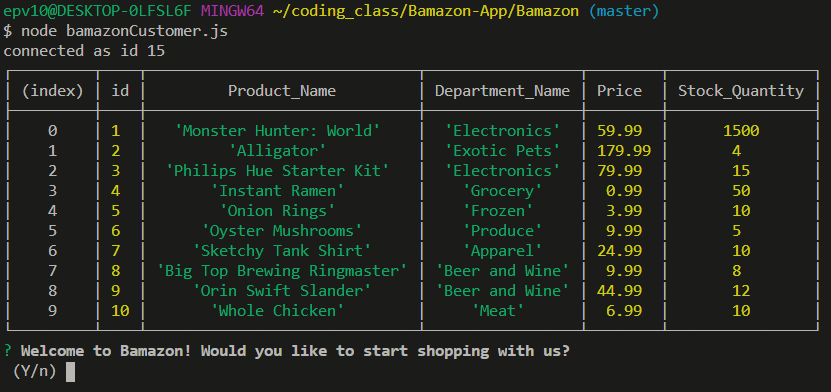
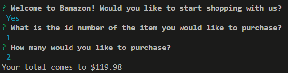

# Bamazon

This app allows the user to shop a database of products through their command line or terminal.

## Overview

### Instructions

1. After you have pulled hte repository navigate to the folder in your terminal and run the following commands to install node and the required dependencies.
    * npn init -y
        * This downloads the node package.
    * npm install 
        * This will install the node package.
    * npm install console.table
        * This will download and install the console.table package to view the inventory list as a table in the terminal.
    * npm install inquirer 
        * This will download and install the package require to prompt the questions for shopping the inventory.
    * npm install mysql 
        * This will download and install the package needed to interact with the database of products currently in stock 

2. After all node packages have been installed navigate to the bamazonCustomer.js file in your terminal and run the following command 
    * node bamazonCustomer.js
    * The terminal should display the current inventory and a prompt asking if you would like to start shopping
    * Type "y" to start shopping or "n" to exit the app.

3. The app with then ask for the id of the product you would like to purchase. Type the id number of the product you would like to purchase.

4. The app will now ask how many of the product you would like to purchase. Type the quantity you are looking for as a number. The total price for your purchase will then be displayed.
